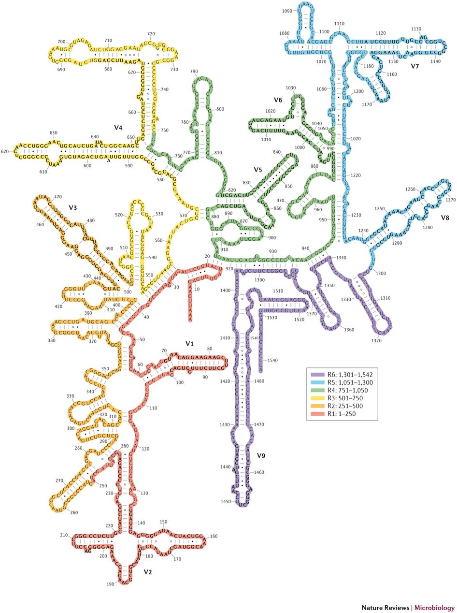

Microbiome Introduction
=======================

Learning Goals
--------------

1. What is a host associated microbiome?

2. Define:
    - Microbiota
    - Microbiome
    - Metagenome
    - Metabolome

The Human Gut Microbiome
------------------------

What is it?

Why is it?

When is it?

16S Ribosomal DNA and Phylogenetic Markers
------------------------------------------

The methodology we are discussing today falls under the umbrella of amplicon sequencing.

Amplicon sequencing involves:
   1. Extracting all DNA from a microbial community.
   2. PCR amplifying a specific marker gene shared by the microbes of interest.
   3. Sequencing all of the PCR amplicons.
   4. Assigning the genetic sequences back to reference databases of known microbes.
   5. Compiling counts of the number of sequences representing each taxon.

This is most often done for Bacterial communities with the 16S Ribosomal DNA amplicon.

16S rRNA Structure 
   - The RNA component of bacteria ribosomes forms bonds between nucleotide bases.
   - The attraction of these bases forms secondary loop and hairpin structures.
   - Tertiary structure forms and combines with protein components of the ribosome to form an active unit.

This is a useful gene because:
   - It is shared by all bacteria
   - It is slow evolving
   - It has regions that are more conserved and regions that are variable, or evolve more quickly. 

   
Nine variable regions are each separated by conserved regions.